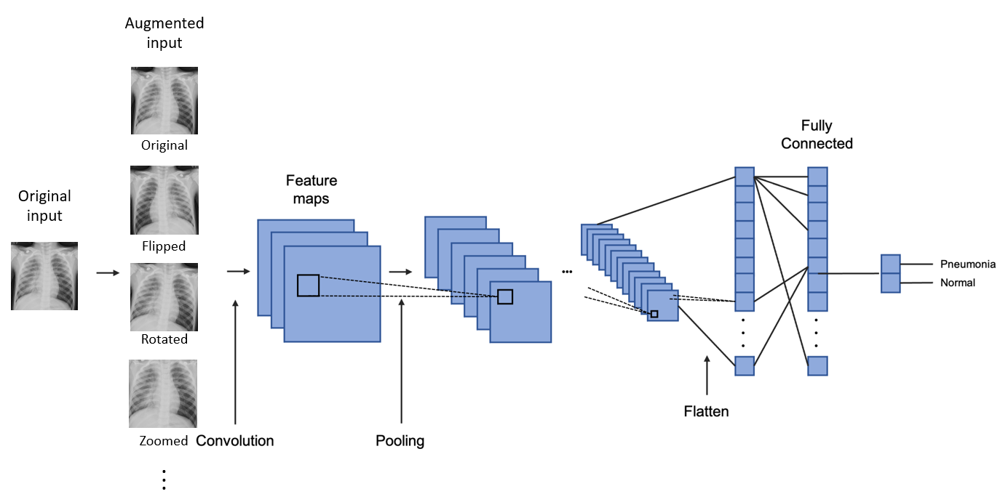
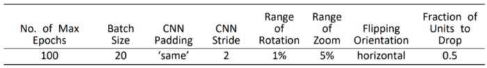
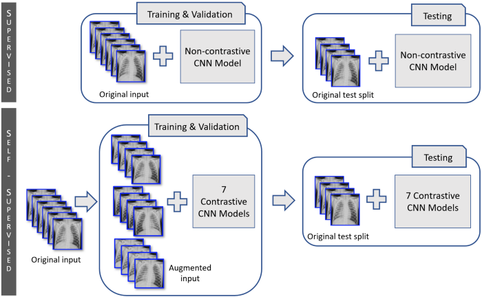
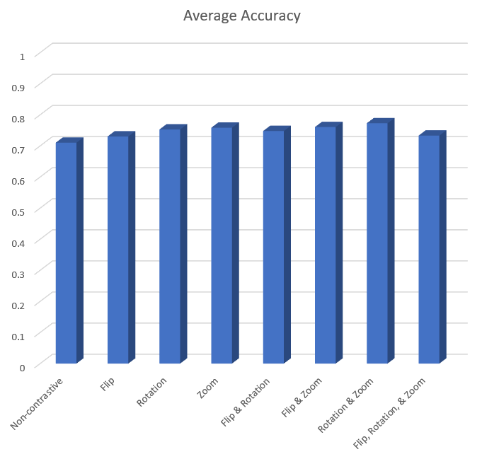

<!-- PROJECT SHIELDS -->
<!--
*** I'm using markdown "reference style" links for readability.
*** Reference links are enclosed in brackets [ ] instead of parentheses ( ).
*** See the bottom of this document for the declaration of the reference variables
*** for contributors-url, forks-url, etc. This is an optional, concise syntax you may use.
*** https://www.markdownguide.org/basic-syntax/#reference-style-links
-->
[![Contributors][contributors-shield]][contributors-url]
[![Forks][forks-shield]][forks-url]
[![Stargazers][stars-shield]][stars-url]
[![Issues][issues-shield]][issues-url]
[![MIT License][license-shield]][license-url]
[![LinkedIn][linkedin-shield]][linkedin-url]

<!-- PROJECT LOGO -->
 

   

  <h3 align="center">Chest X-Ray Images (Pneumonia)</h3>

  

    <a href="https://www.kaggle.com/paultimothymooney/chest-xray-pneumonia"><strong>Explore the docs »</strong></a>
     
  

<!-- TABLE OF CONTENTS -->

  
Table of Contents

  <ol>
    <li>
      <a href="#abstract">Abstract</a>
    </li>
    <li>
      <a href="#introduction">Introduction</a>
    </li>
    <li><a href="#related-work">Related Work</a></li>
    <li>
      <a href="#method">Methods</a>
      <ul>
        <li><a href="#algorithms-and-architectures">Algorithms and Architectures</a></li>
        <li><a href="#data-preprocessing">Data Preprocessing</a></li>
        <li><a href="#hyperparameters">Hyperparameters</a></li>
      </ul>
     </li>
    <li><a href="#experimental-design">Experimental Design</a></li>
    <li><a href="#experimental-results">Experimental Results</a></li>
    <li><a href="#conclusions">Conclusions</a></li>
    <li><a href="#references">References</a></li>
  </ol>

<!-- ABSTRACT -->
## Abstract

The emergence of convolutional neural networks (CNN) has contributed to substantially enhancing the performance of supervised machine learning models trained on medical image data to detect diseases.
However, even CNN machine learning models are likely to perform unsatisfactorily if only a small dataset is available for training due to the scarcity of the target disease or simply due to high costly data preparation.
This study aimed at investigating the effectiveness of a selfsupervised learning model called contrastive learning to augment such small datasets, which may help boost the accuracy of disorder detection.
The baseline model and contrastive learning model were trained based on a small number of chest X-ray images and tested 100 times to statistically compare the detection accuracies.
A statistically significant difference between the average accuracies of the baseline model and the best contrastive model was detected, as the result of a two-way t-test at the significance level of 1%.

<!-- INTRODUCTION -->
## Introduction

Machine learning-based disease detection may contribute to preventing death or severe aftereffects of diseases.
By playing a key role in efficiently classifying and analyzing diseases, it can aid pathologists in improving the accuracy of their diagnoses.
Chest X-rays (CXR) are one of the most significant sources to examine for spotting thoracic abnormalities.
Specifically, pneumonia has been the leading cause of death across the world that risks all ages, from children to elders, as exemplified by 2.56 million deaths worldwide in 2017.
Accordingly, it is one of the most commonly observed diseases for which doctors refer to chest radiographs.
The challenge is that pathologists often have difficulty precisely spotting pneumonia on CXR images because they may also reflect abnormalities of other diseases, which tend to resemble the vague patterns of pneumonia.

There exist some solutions to handle the intricacy of detecting pneumonia that use deep learning algorithms to classify CXR images.
Similar to cases of some identification models trained on images of non-medical objects, one typical approach involves supervised convolutional neural network (CNN) learning based on CXR images.
However, unlike other natural images, acquiring enough medical images to avoid overfitting is generally not easy because there is not much CXR data available.
Even with a sufficient number of CXR images, it can be too costly and require too much time to have them labeled by pathologists, due to the expertise needed to precisely attach annotations to them.
Partly because of this, some initial approaches involved general non-medical images for initial training.
However, this kind of methods may not lead to optimal prediction performance compared to the ones that are trained using medical data.

For our study, we intended to use CXR images, rather than non-medical images, upfront when training, in order to achieve optimal performances.
Then, instead of fully supervised learning, a self-supervised training approach is proposed.
This approach is expected to yield a better performance than supervised learning approaches when there are only a small number of available CXRs with ground truth values.
The contrastive learning method, a self-supervised model, may help overcome the scarcity of labeled dataset if boosted with data augmentation techniques, which have shown considerable successes in dealing with relatively small datasets of natural images.
Using the given small amount of data as anchor images for augmenting in various ways, the contrastive learning approach could expand the original training data to lower the risk of overfitting.

<!-- RELATED WORK -->
## Related Work

One major difference between our team’s method and the methods used in [1] and [2] is that our project starts with CXR images to train the deep learning model on and then tests on similar medical images, while the two references used deep learning algorithms that were previously trained on non-medical image datasets.
The approach of relying on non-medical training appears to have been chosen because there were relatively small amounts of medical visual data available at the time of their study, in 2015.

Next, our project is also different from [3] and [4], which relied on supervised learning, in that it utilizes self-supervised learning with an augmented dataset.
As there were insufficient number of labeled CXRs for training, some additional data were created using several techniques to graphically alter these anchor CXRs and labeled identically with respective anchor images.
These newly generated data were expected to serve as additional reference points while the contrastive learning models were trained.
An improved performance of a linear classifier, which was 76.5%, as a result of contrastive learning on non-medical pictorial data was reported by [5].

In order to lower the possibility of overfitting, the drop-out technique was applied to both the baseline model and the contrastive learning models, as recommended by [6].
This regularization method is claimed to enhance the accuracy of neural networks to train on multiple types of data including visionary data through supervised learning.

<!-- METHOD -->
## Metohd

Our goal is to generate a model that may enhance the pneumonia classification, which is typically observed among supervised learning models with a small amount of labeled training data.
Our model is built based on the concept of contrastive learning, a subset of self-supervised learning. Data augmentation in contrastive learning is perceived as beneficial for overcoming the scarcity of annotated data in real world.
This approach creates additional data points with labels by altering the anchor images, which are the original annotated images, to augment the data training pool, presumably leading to higher classification accuracies.

### Algorithms and Architectures

The convolutional neural network (CNN) was chosen to conduct the deep learning process on the CXR images for both of the proposed algorithm and the baseline algorithm.
Our model started with layers that augment input images through several ways of altering them.
Seven possible combinations of three pictorial augmentation techniques offered by TensorFlow were used: RandomFlip, RandomRotate, and RandomZoom.
The architecture of our CNN models consisted of five convolutional layers with five corresponding max pooling layers at the feature extraction stage.
The number of filters on the first layer was set to 16 and it doubled on each consecutive convolutional layer with the same kernel size of 3.
The Rectified Linear Unit (ReLU) activation function was used to reduce the likelihood of vanishing gradient.
Features were extracted through this forward propagation.

The output from the last max pooling layer at the feature extraction stage was transformed to a sequential vector representation through the flattening layer.
This vector representation was passed on toward the classification phase that comprised three dense layers including two dropout layers to control for overfitting and the last dense layer with the SoftMax activation.
The Adam optimization algorithm, the SparseCategoricalCrossentropy loss function, and the evaluation metric of accuracy were chosen to configure the model compilation.

### Data Preprocessing

All the RGB CXR data were resized to 180 pixels by 180 pixels and converted to gray scale images for the speed of calculation. We formed a small number of data points (n = 200) from the original CXRs offered by Kaggle.com for the training split on purpose.
These training data points were used as the anchor images for augmentation.
Each input image, x, passes through two stages of augmentation, each of which creates a tweaked view of the input image, ¯x = Augmentation(x).
This kind of augmentation is deemed beneficial because sizes of chests pictured in CXR images may vary depending on how big the X-rayed patients were and/or the specific magnitudes at which the CXRs were taken.
Another variation was the deviation of the angles at which chests were X-rayed, due to the slightly different tolerance in patients’ upright orientation that each X-ray technician bears.
According to these assumptions, we chose random rotation and random zooming as the promising methods of augmentation, as shown in Figure 1.
Another, but less promising, technique random flip was also included for comparison.

   

The size of the validation split was even smaller (n = 100) considering the intended scenario of small available dataset.
As more emphasis was put on the generalizability of the test results, a relatively large (n = 624) test split was set aside.

### Hyperparameters

The hyperparameter that was optimized on the validation set was the number of epochs for all the trained models.
The number of epochs that yielded the best validation accuracy of each trained model was saved and retrieved for evaluation on the test split.
All the other hyperparameters were fixed for the purpose of experiments as can be seen in Table 1.

   

<!-- EXPERIMENTAL DESIGN -->
## Experimental Design

In order to simulate the target situation of this study, where there is only a small number of labeled data points, we pretended that there are only 300 data points with labels for training and validation.

The baseline model of non-contrastive supervised learning and the seven models of contrastive learning were evaluated on the test split after they were fine-tuned with the optimal number of epochs.
The training, validation, and evaluation processes were repeated 100 times per each of the eight models for a t-test to compare the average accuracy of the baseline model and the average accuracy of the contrastive model that showed the best performance.
The significance level was set to 0.01 to test the null hypothesis that there is no statistical difference between the two compared average accuracies.
The confidence interval at the confidence level of 99

As typically used as the evaluation metric for many cases of neural network learning, accuracy (f1-score) produced by the API of Keras is used for the current CNN learning study.
All statistical analyses were carried out using MS Excel.

   

<!-- EXPERIMENTAL RESULTS -->
## Experimental Results

All the self-supervised machine learning models performed better than the supervised one based on the original CXR images as can be seen from Figure 3.
Among the seven combinations of data augmentation methods, the result the from the combination of random rotation and random zooming showed the best average accuracy of 77.3%, while the average baseline accuracy was 71%.

the angles at which chests were X-rayed, due to the slightly different tolerance in patients’ upright orientation that each X-ray technician bears.
According to these assumptions, we chose random rotation and random zooming as the promising methods of augmentation, as shown in Figure 1.
Another, but less promising, technique random flip was also included for comparison.

As predicted, the random flip showed the lowest average accuracy among the seven combinations of augmentation.
The fact that the only combination without random flipping, which was based on random rotation and random zooming, showed the highest performance conforms to the speculation that random flipping would be the weakest augmentation.
This seems probable as flipped CXR images are not likely to be included in either the test split or new data, which only consisted of original data, owing to the salient side marking “R”.

The conservative-level of 0.01 was set because the statistical inference would affect medical decisions.
The null hypothesis was rejected (p < 0.01) indicating that the observed difference was statistically significant.
We can be 99% confident that the actual difference between the baseline and best contrastive average accuracies is between 5.7% and 6.8%, with a narrow range of 1.1%.

   

   

<!-- CONCLUSIONS -->
## Conslusions

According to the above result, we can conclude that in situations where only a small number of annotated medical images are available, it may be worth building a machine learning model using augmented data with the combination of random rotating and random zoom, as presented in this paper.
These selfsupervised contrastive CNN models are likely to enhance the prediction accuracy of rare disease cases that have not been reported very frequently.
However, the importance of acquiring as much data as possible should still be emphasized for an effective model to be trained because the accuracy observed in this study is slightly over 77% even after boosting.

We suggest some next steps to follow based on the findings of this paper.
First, a more in-depth study aimed at identifying optimal hyperparameters for the contrastive learning algorithm is in need.
This paper only dealt with three factors of augmentation, namely, random flipping, rotating, and zooming.
However, further research can shed light on the effects of some other hyperparameters, such as changed exposure of CXR images or Sobel filtering.
The optimal combination of such hyperparameters appear to require more robust investigation to further enhance the accuracy.
The effects of hyperparameters of the extent to which CXR images are tweaked, for example the range of rotation or zooming, also seem worth investigating.
Another type of further research may examine the effect of the contrastive machine learning algorithm on making predictions on other kinds of medical data such as CAT scan or ultrasonic images.

<!-- REFERENCES -->
## References
1. Bar, Y., Diamant, I., Wolf, L., Lieberman, S., Konen, E., Greenspan, H.: Chest pathology detection using deep learning with non-medical training. In: 2015 IEEE
12th international symposium on biomedical imaging (ISBI), IEEE (2015) 294–297
2. Bar, Y., Diamant, I., Wolf, L., Greenspan, H.: Deep learning with non-medical training used for chest pathology identification. In: Medical Imaging 2015: ComputerAided Diagnosis. Volume 9414., International Society for Optics and Photonics (2015) 94140V
3. Baltruschat, I.M., Nickisch, H., Grass, M., Knopp, T., Saalbach, A.: Comparison of deep learning approaches for multi-label chest x-ray classification. Scientific reports 9(1) (2019) 1–10
4. Rajpurkar, P., Irvin, J., Zhu, K., Yang, B., Mehta, H., Duan, T., Ding, D., Bagul, A., Langlotz, C., Shpanskaya, K., et al.: Chexnet: Radiologist-level pneumonia detection on chest x-rays with deep learning. arXiv preprint arXiv:1711.05225 (2017)
5. Chen, T., Kornblith, S., Norouzi, M., Hinton, G.: A simple framework for contrastive learning of visual representations. In: International conference on machine learning, PMLR (2020) 1597–1607
6. Srivastava, N., Hinton, G., Krizhevsky, A., Sutskever, I., Salakhutdinov, R.: Dropout: a simple way to prevent neural networks from overfitting. The journal of machine learning research 15(1) (2014) 1929–1958

<!-- MARKDOWN LINKS & IMAGES -->
<!-- https://www.markdownguide.org/basic-syntax/#reference-style-links -->
[contributors-shield]: https://img.shields.io/github/contributors/othneildrew/Best-README-Template.svg?style=for-the-badge
[contributors-url]: https://github.com/othneildrew/Best-README-Template/graphs/contributors
[forks-shield]: https://img.shields.io/github/forks/othneildrew/Best-README-Template.svg?style=for-the-badge
[forks-url]: https://github.com/othneildrew/Best-README-Template/network/members
[stars-shield]: https://img.shields.io/github/stars/othneildrew/Best-README-Template.svg?style=for-the-badge
[stars-url]: https://github.com/othneildrew/Best-README-Template/stargazers
[issues-shield]: https://img.shields.io/github/issues/othneildrew/Best-README-Template.svg?style=for-the-badge
[issues-url]: https://github.com/othneildrew/Best-README-Template/issues
[license-shield]: https://img.shields.io/github/license/othneildrew/Best-README-Template.svg?style=for-the-badge
[license-url]: https://github.com/othneildrew/Best-README-Template/blob/master/LICENSE.txt
[linkedin-shield]: https://img.shields.io/badge/-LinkedIn-black.svg?style=for-the-badge&logo=linkedin&colorB=555
[linkedin-url]: https://linkedin.com/in/othneildrew
[product-screenshot]: images/screenshot.png
